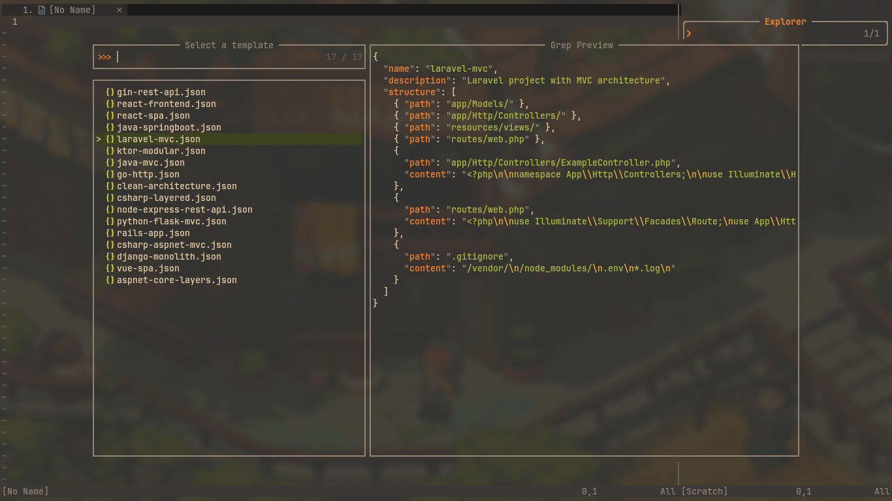

<h1 align="center">templ.nvim</h1>

<p align="center">


</p>

`templ.nvim` is a simple yet powerful Neovim plugin that lets you quickly scaffold new projects using predefined JSON templates.

Create full project structures with directories and files, including custom file content. It also integrates with [Telescope.nvim](https://github.com/nvim-telescope/telescope.nvim) for a smooth selection experience.

---

## ✨ Preview

<table>
    <tr>
        <td></td>
    </tr>
</table>

## ✨ Features

- 🔧 Generate project structure from JSON templates
- 🧭 Telescope integration for easy template selection
- ⚙️ Customizable template path

---

## 📦 Installation

With [lazy.nvim](https://github.com/folke/lazy.nvim):

```lua
{
  "viitorags/templ.nvim",
  config = function()
    require("templ").setup({
      templates_path = "~/my-templates" -- optional
    })
  end
}
```

## 🚀 Usage

##### Commands

- :CreateProject {template_path} – Create a project using a JSON template.
- :CreateProjectSelect – Open a Telescope picker to select a template.

## 📁 Template Format

Templates are JSON files like the following:

```json
{
  "name": "my-template",
  "description": "Template description",
  "structure": [
    { 
        "path": "src/index.js", 
        "content": "console.log('Hello!');" 
    },
    { "path": "src/components/" },
    { 
        "path": ".gitignore", 
        "content": "node_modules\n" 
    }
  ]
}
```

## 📂 Template Location

By default, the plugin uses its internal /template directory. You can override this with your own directory via the setup() function:

```lua
require("templ").setup({
  templates_path = "~/my-templates"
})
```
